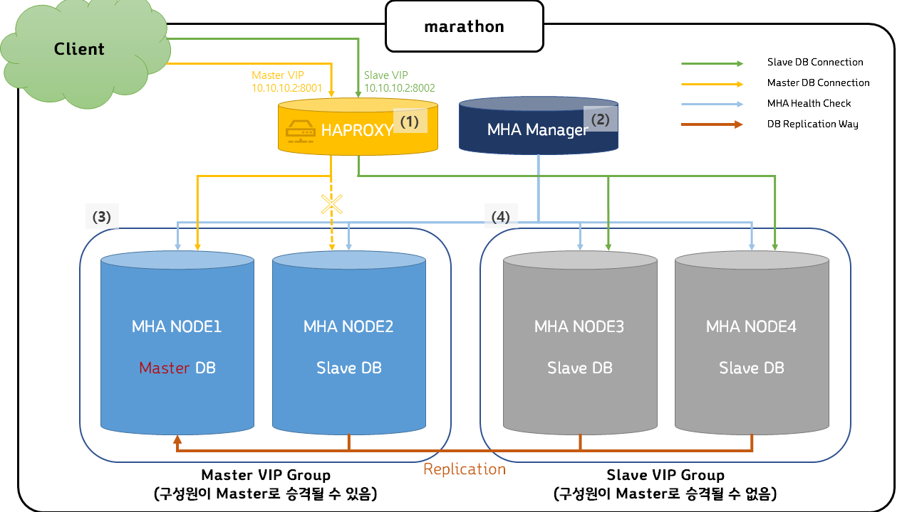
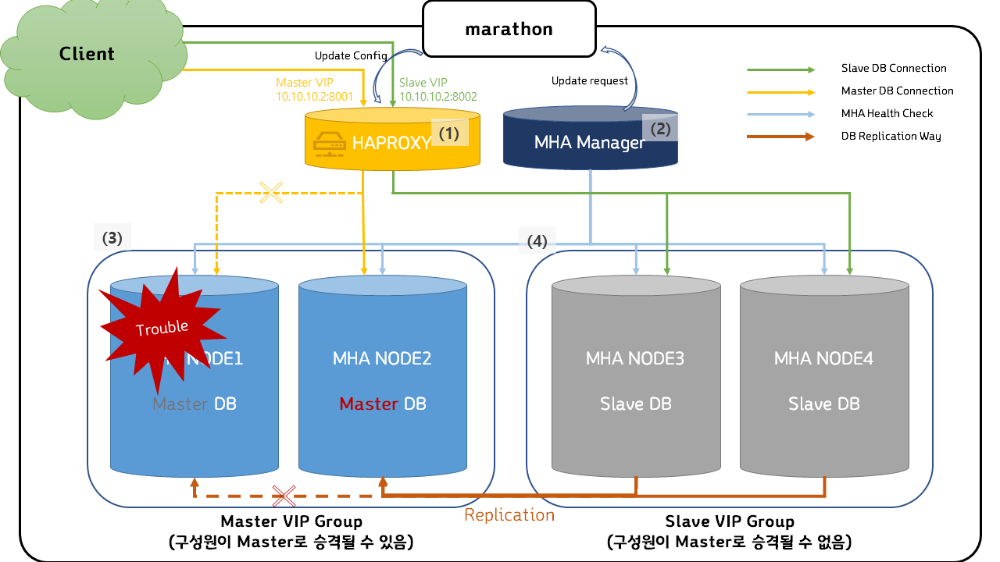

# MHA for marathon

본 솔루션은 marathon + mesos 환경 위에서 mysql 데이터베이스 failover 솔루션 중 하나인 MHA를 보다 효율적이고 지속적이게 이용할 수 있는 방법에 대해 고민하다가 만들게 된 솔루션 입니다. 허접한 실력으로 주먹구구식으로 만든 것이라 많이 부족하지만, 아직 초기 단계라고 생각하며, 고수 분들의 도움을 받아서 앞으로 더욱 발전 시키고 싶은 생각에 현재 구현 된 내용에 대해서 공유하려고 합니다.

## 기존 MHA의 한계

mha는 master, slave 관계에 있는 mysql DB에 대해서 master에 문제가 생길 경우, 빠르게 slave를 master로 승격시켜 다운 타임을 최소화 해주는 failover 솔루션입니다. 하지만, mha는 다음과 같은 이유로 손이 많이 갑니다. 

1. mha는 manager라는 관리 관리 서비스가 별도로 동작하는데, 이 서비스는 failover가 1회 발생하고 나면 프로세스가 종료되어버리는 일회용 서비스입니다. 때문에 failover가 한번 발생하면 정해진 순서에 따라 서비스들을 다시 동기화 시키고, manager를 재시작하는 등의 작업이 필요합니다..

2. jdbc등의 DB 커넥터들에는 db의 상태체크까지 하는 기능이 없기 때문에, db로의 트래픽을 haproxy와 같은 프록시를 통해 중계해야하는데, proxy 설정은 별도로 관리해 주어야 합니다.

## MHA for marathon Architecture



_그림1_



_그림2_

MHA for marathon은 기본적으로 모든 구성요소들을 컨테이너화 하여 동작시키고, 총 6개의 컨테이너로 구성되어 있습니다.

- haproxy 컨테이너
- MHA manager 컨테이너
- mysql db 4대

현재는 고정으로 DB 4대로만 구성할 수 있도록 세팅이 되어 있지만, 추후 개발을 통해서 DB 갯수는 2~n 개로 유동적으로 세팅 할 수 있도록 발전 시킬 예정입니다.

그리고,  `그림(1,2)` 을 참고하면 기능상 분류로 크게 네 부분으로 나눌 수 있습니다.

### (1) HAPROXY 컨테이너

haproxy 컨테이너는 장애 상황에 따라 mha manager에 의해 동적으로 변경되는 mysql db의 상태를 추적하여, 어플리케이션이 고정된 VIP를 통해 항상 정상 상태의 db와 통신 할 수 있도록 경로를 제공하는 역할을 합니다. haproxy 컨테이너는 상황에 따라 다른 config 값으로 동작하기 위해서 2가지 버전의 config로 작성된 컨테이너 이미지로 제작되고, manager에 의해 master db에 failover가 발생할 경우 marathon을 통해서 다른 이미지로 재배포가 일어납니다.

어플리케이션은 db의 상태와 관계없이 haproxy가 제공하는 고정된 두개의 VIP(master db, slave db)를 통해 안정적인 서비스를 제공할 수 있게 됩니다.

### (2) MHA manager 컨테이너

MHA 솔루션이 본래 제공하는 기능인 failover와 함께 다양한 기능을 제공합니다.

1. master failover
2. haproxy 컨테이너 재배포
3. 각 DB replication 상태 확인 및 비정상 시 auto replication 수행
4. mha manager 프로세스 자동 재시작

### (3) Master VIP 컨테이너 그룹

manager에 의해서 master db로 승격될 수 있는 권한을 가진 컨테이너 그룹입니다. master db역할은 한 순간에 오직 한 컨테이너만 수행할 수 있고, Master VIP 그룹에 속한 다른 컨테이너들은 slave db로써 현재 master 역할을 수행중인 컨테이너를 replication하며 대기 합니다. 

haproxy를 통해 외부로 통신이 가능한 컨테이너는 오직 master 역할을 수행중인 컨테이너로 제한되며, 해당 컨테이너는 읽기 및 쓰기가 모두 발생할 수 있습니다.

### (4) Slave VIP 컨테이너 그룹

오직 slave 역할만을 수행하는 컨테이너 그룹입니다. 항상 master 역할을 수행하는 컨테이너를 repliaction 하며, haproxy를 통해서 VIP 컨테이너 그룹에 속해 있는 모든 구성원이 외부와 통신이 가능합니다. Slave VIP 그룹의 컨테이너들은 오직 읽기 작업만 수행할 수 있습니다.

## How to Install

1.  mha-for-marathon git 프로젝트를 clone 합니다.

```bash
git clone https://github.com/GeunSam2/mha-for-marathon.git
cd mha-for-marathon/
```

2. `mha-for-marathon/conf/common/mysql1 ~ 4.cnf` 파일들을 수정하여 mysql db에 적용할 config를 취향에 맞게 작성합니다. 다른 설정이 필요하지 않은 경우 기본값을 사용합니다. `(선택)`

3. `mha-for-marathon/conf/sampledb` 경로에 위치한 `haproxy.json` 파일을 수정합니다. `(필수)`

해당 파일은 haproxy컨테이너가 marathon에 올라갈때 사용되는 templete json파일입니다.

```bash
{
  "id": "%your_service_id%",
...
중략
...
      {
        "containerPort": %port_for_master_group%,
        "hostPort": %port_for_master_group%,
        "protocol": "tcp",
        "name": "master_group"
      },
      {
        "containerPort": %port_for_slave_group%,
        "hostPort": %port_for_slave_group%,
        "protocol": "tcp",
  ...
  중략
  ...
  "cpus": %cpu_limit%,
  "disk": 0,
  "instances": 1,
  "maxLaunchDelaySeconds": 300,
  "mem": %mem_limit%,
  ...
  중략
  ...
```
`%` 로 감싸진 부분들을 수정합니다.

- %your_service_id% : haproxy 컨테이너가 marathon에서 위치할 경로를 지정합니다.
- %port_for_master_group% : master db그룹과 통신할 haproxy frontend 포트를 지정합니다.
- %port_for_slave_group% : slave db그룹과 통신할 haproxy frontend 포트를 지정합니다.
- %cpu_limit% : haproxy 컨테이너의 cpu 리소스를 조정합니다.
- %mem_limit% : haproxy 컨테이너의 memory 리소스를 조정합니다.

4.`mha-for-marathon/conf/sampledb` 경로에 위치한 `haproxy1~2.cnf` 파일을 수정합니다. `(필수)`

해당 파일들은 haproxy컨테이너 내부설정으로 들어가게 될 haproxy 설정 파일들입니다.

```bash
global
    #debug

defaults
    mode tcp
    timeout connect 3000 # default 10 second time out if a backend is not found
    timeout client 3000
    timeout server 3000
    maxconn     10000
    retries     3
frontend master
        bind *:%port_for_master_group%
        default_backend master_back
backend master_back
        mode tcp
        balance roundrobin
        server master %master_1_ip%:%master_1_port%  check
frontend slave
        bind *:%port_for_slave_group%
        default_backend slave_back
backend slave_back
        mode tcp
        balance roundrobin
        server slave1 %slave_1_ip%:%slave_1_port%  check
        server slave2 %slave_2_ip%:%slave_2_port%  check
```

`%` 로 감싸진 부분들을 수정합니다.

- %port_for_master_group% : master db그룹과 통신할 haproxy frontend 포트를 지정합니다.
- %port_for_slave_group% : slave db그룹과 통신할 haproxy frontend 포트를 지정합니다.
- %master_{num}_ip% : master db 그룹의 특정 db 컨테이너에서 동작중인 db와 직접 통신할 수 있는 ip를 지정합니다.
- %master_{num}_port% : master db 그룹의 특정 db 컨테이너에서 동작중인 db와 직접 통신할 수 있는 port를 지정합니다.
- %slave_{num}_ip% : slave db 그룹의 특정 db 컨테이너에서 동작중인 db와 직접 통신할 수 있는 ip를 지정합니다.
- %slave_{num}_port% : slave db 그룹의 특정 db 컨테이너에서 동작중인 db와 직접 통신할 수 있는 port를 지정합니다.

5.`mha-for-marathon/Makefile`의 Docker 이미지 생성 이름과 관련된 변수를 수정합니다.

```bash
SERVICE_N := sampledb
TAG := v1
IMAGE_NAME_BASE := geunsam2/mha-$(SERVICE_N)

.PHONY: help build push

...
중략
...
```
IMAGE_NAME_BASE := geunsam2/mha-$(SERVICE_N) 부분을 수정합니다.

6.Makefile이 위치한 디렉토리에서 다음 명령을 수행합니다.

```bash
make build
```

7. json 파일을 작성하여 marathon에 배포합니다.

```bash
내용 보강 필요
```

8. manager 컨테이너의 로그를 관찰합니다.

```bash
내용 보강 필요
```